# Viral Story Generator 🚀✨

Welcome! I'm excited to share the **Viral Story Generator**, a project that sits at the intersection of automated content creation and cutting-edge AI. This isn't just a tool; it's a demonstration of how sophisticated systems can be engineered to tackle creative challenges, transforming ideas into engaging short-form video content.

Imagine effortlessly generating compelling story scripts, complete with voiceovers and detailed storyboards, all powered by a local LLM and integrated with services like ElevenLabs. This project showcases the ability to design, build, and deploy complex applications that streamline creative workflows. If you're looking for innovative solutions and expertise in AI-driven automation, you've come to the right place. Let's explore what's possible! 🎉

This project was a little vision I had when AI was first becoming a big thing (2022). I wanted to create something that can make viral videos or stories for me, just by providing it a link or a topic and letting it do its thing. Working on this has thought me many things about LLMs and how to work them (lol).

If you have something you would like to create, implement, or integrate, please feel free to reach out to me at [princeboachie@gmail.com](mailto:princeboachie@gmail.com).

---

## Features
- **Story Script Generation:** Automatically generates creative story scripts with video descriptions using a local LLM (cloud coming soon).
- **Audio TTS:** Converts the narrative into high-quality MP3 audio using ElevenLabs TTS. 🔊
- **Storyboard Creation:** Produces detailed JSON-formatted storyboards for video planning and production.
- **Source Cleansing & Summarization:** Merges and summarizes content from multiple web sources or provided text to form a coherent narrative base.
- **Web Scraping:** Utilizes Crawl4AI to efficiently extract content from web URLs.
- **RESTful API:** Provides HTTP endpoints for seamless integration and interaction.
- **Task Queue Management:** Employs Redis for robust background task processing.
- **Containerized Deployment:** Docker and Docker Compose for easy setup, development, and production deployment.
- **Scalable Architecture:** Designed with separate, scalable worker services for different tasks (API, scraping, generation).
- **Monitoring:** Integrated Prometheus and Grafana for production observability.

---

## Table of Contents
- [Viral Story Generator 🚀✨](#viral-story-generator-)
- [Features](#features)
- [Table of Contents](#table-of-contents)
- [Project Overview](#project-overview)
- [Architecture](#architecture)
  - [System Components](#system-components)
  - [Architecture Diagram](#architecture-diagram)
- [Program Flow](#program-flow)
  - [Request Lifecycle](#request-lifecycle)
  - [Program Flow Diagram](#program-flow-diagram)
- [Core Technologies & Tools](#core-technologies--tools)
- [Codebase Structure](#codebase-structure)
- [Installation](#installation)
- [Configuration](#configuration)
- [Setting Up Your Environment](#setting-up-your-environment)
- [Local Development & Testing](#local-development--testing)
  - [Setup Development Environment](#setup-development-environment)
  - [Running Tests](#running-tests)
  - [Manual Testing](#manual-testing)
  - [Debugging](#debugging)
- [Usage](#usage)
  - [API Endpoints](#api-endpoints)
- [Docker Setup 🐳](#docker-setup-)
  - [Development Setup](#development-setup)
  - [Worker Commands](#worker-commands)
  - [Production Setup](#production-setup)
  - [Container Architecture](#container-architecture)
- [Key Modules and Functionality](#key-modules-and-functionality)
- [Dependencies & Citations](#dependencies--citations)
- [Contributing](#contributing)
- [License](#license)
- [Changelog](#changelog)

---

## Project Overview

The Viral Story Generator is a comprehensive system designed to automate the creation of short, engaging video scripts. It leverages a local Large Language Model (LLM) for content generation, ElevenLabs for realistic Text-to-Speech (TTS) audio, and Crawl4AI for web content extraction. The system is architected as a set of microservices, orchestrated with Docker, and managed via a RESTful API. This makes it a powerful tool for content creators looking to streamline their production pipeline.

---

## Architecture

The system is built upon a microservices architecture to ensure scalability, maintainability, and separation of concerns. Key components communicate via a Redis message queue for asynchronous task processing.

### System Components

1.  **FastAPI Application (`api.py`):**
    *   Serves as the main entry point for user requests.
    *   Handles HTTP request validation (using Pydantic models).
    *   Enqueues tasks (e.g., story generation, scraping) into Redis.
    *   Provides endpoints for status checking and retrieving results.

2.  **Worker Processes (`worker_runner.py`, `api_worker.py`, `scrape_worker.py`, `queue_worker.py`):**
    *   **`scrape_worker.py`:** Dedicated to web scraping tasks. It consumes URLs from a queue, uses Crawl4AI to fetch and parse content, and stores the results for further processing.
    *   **`api_worker.py` / `queue_worker.py`:** These workers handle the core story generation pipeline. They:
        *   Dequeue tasks from Redis.
        *   Orchestrate calls to the LLM for script generation.
        *   Invoke ElevenLabs for TTS audio creation.
        *   Trigger storyboard generation.
        *   Manage data storage and status updates.

3.  **LLM Integration (`llm.py`):**
    *   Provides an interface to the configured local Large Language Model.
    *   Manages prompt engineering (using templates from `prompts/`) for generating story scripts and video descriptions.

4.  **ElevenLabs TTS (`elevenlabs_tts.py`):**
    *   Integrates with the ElevenLabs API to convert text narratives into high-quality MP3 audio files.

5.  **Storyboard Generation (`storyboard.py`):**
    *   Takes the generated script and produces a structured JSON storyboard, detailing scenes, dialogues, and visual cues.

6.  **Redis:**
    *   Acts as a robust message broker for asynchronous task queuing between the API and worker services.
    *   Potentially used for caching and managing shared state or job metadata.

7.  **Storage (`storage/` directory & `data/`):**
    *   Persistent local file storage for:
        *   Generated audio files (`.mp3`).
        *   Story scripts (`.txt`).
        *   Storyboard files (`.json`).
        *   Scraped source content.
        *   Job metadata.

8.  **Docker & Docker Compose:**
    *   Containerizes each service (API, workers, Redis, monitoring tools) for consistent environments.
    *   Simplifies deployment, scaling, and management of the entire application stack.

9.  **Monitoring (Prometheus & Grafana - `monitoring/`):**
    *   Prometheus scrapes metrics from the application services.
    *   Grafana provides dashboards for visualizing these metrics, offering insights into system health and performance (primarily for production).

### Architecture Diagram

```mermaid
graph TD
    subgraph "User Interaction & API Layer (main.py, api.py, api_handlers.py)"
        direction LR
        User["👤 User"] -- HTTP Request (URLs, Config, Topic) --> MAIN_PY["main.py (FastAPI App via uvicorn)"]
        MAIN_PY --> API_PY["api.py (FastAPI Router)"]
        API_PY -- "/generate, /stories" --> AH_CREATE["api_handlers.py: create_story_task()"]
        AH_CREATE -- Returns Task ID --> API_PY
        API_PY -- HTTP Response (Task ID) --> User

        User -- HTTP Request (Task ID) --> JobStatusEndpoint_Combined["GET /api/stories/{task_id}<br/>(api.py)"]
        JobStatusEndpoint_Combined -- Calls --> ApiGetStatus_Combined["api_handlers.get_task_status()"]
        ApiGetStatus_Combined -- Returns Status --> JobStatusEndpoint_Combined
        JobStatusEndpoint_Combined -- HTTP Response (Status, Asset URLs) --> User

        User -- HTTP Request (Asset URL) --> DownloadResultEndpoint_Combined["GET /api/stories/{task_id}/download/...<br/>(api.py)"]
        DownloadResultEndpoint_Combined -- Serves File --> User
    end

    subgraph "Task Queuing (Redis)"
        AH_CREATE -- "Publishes 'generate_story' job" --> RedisQueue["📦 Redis Stream/Queue (api_jobs)"]
        ApiGetStatus_Combined -- Reads from --> RedisQueue
        ApiGetStatus_Combined -- "Reads final status/paths from" --> JobResult_Combined["📝 Job Result/Metadata (in Redis/Storage)"]
    end

    subgraph "Scraping Worker (scrape_worker.py)"
        ScrapeWorker_Combined[🕷️ Scrape Worker]
        Crawl4AI_Combined[🕸️ Crawl4AI Module]
        Internet_Combined["🌐 Internet (for Crawl4AI)"]
        ScrapedData_Combined["📄 Scraped Content"]
        Screenshots_Combined["🖼️ Screenshots"]

        RedisQueue -- Dequeues Scrape Job --> ScrapeWorker_Combined
        ScrapeWorker_Combined -- Uses --> Crawl4AI_Combined
        Crawl4AI_Combined -- Fetches Content --> Internet_Combined
        ScrapeWorker_Combined -- Stores --> Screenshots_Combined
        ScrapeWorker_Combined -- Stores --> ScrapedData_Combined
        ScrapeWorker_Combined -- Updates Job Status in --> JobResult_Combined
        ScrapeWorker_Combined -- Publishes Generation Job (refs ScrapedData/Screenshots) --> RedisQueue
    end

    %% Combined Content Generation Process to match large yellow block in image
    subgraph "Content Generation Process (Workers, LLM, Prompts)"
        direction TB

        subgraph "B1. Queue Worker (via worker_runner.py, queue_worker.py)"
            WR_RUNNER["worker_runner.py: main()"] -- "cmd: worker --worker-type queue" --> QW_MAIN["queue_worker.py: main()"]
            QW_MAIN --> QW_RUN_WORKER["queue_worker.py: run_worker()"]
            QW_RUN_WORKER --> QW_PRELOAD_Q["queue_worker.py: preload_components()"]
            QW_RUN_WORKER --> QW_CONSUME["queue_worker.py: run_api_job_consumer()"]
            QW_CONSUME -- "Consumes 'generate_story' job from" --> RedisQueue
            QW_CONSUME -- "For each job" --> QW_PROCESS_SINGLE["queue_worker.py: process_single_api_job()"]
            QW_PROCESS_SINGLE --> UTIL_PROC_JOB["utils.api_job_processor.py: process_api_job()"]
        end

        subgraph "B2. API Worker (via api_worker.py)"
            AW_MAIN["api_worker.py: main()"] --> AW_RUN_WORKER["api_worker.py: run_worker()"]
            AW_RUN_WORKER --> AW_PRELOAD_A["api_worker.py: preload_components()"]
            AW_RUN_WORKER --> AW_PROCESS_JOBS["api_worker.py: process_api_jobs()"]
            AW_PROCESS_JOBS -- "Consumes 'generate_story' job from" --> RedisQueue
            AW_PROCESS_JOBS -- "For each job" --> UTIL_PROC_JOB
        end

        subgraph "C. Core Job Processing & LLM Orchestration (utils.api_job_processor.py)"
            UTIL_PROC_JOB -- "Retrieves" --> ScrapedData_Combined
            UTIL_PROC_JOB -- "Retrieves" --> Screenshots_Combined
            UTIL_PROC_JOB -- "If cleaning markdown" --> LLM_CLEAN["llm.py: clean_markdown_with_llm()"]
            UTIL_PROC_JOB -- "If generating story script" --> LLM_PROCESS["llm.py: process_with_llm()"]
            LLM_CLEAN -- "Outputs Cleaned Markdown" --> UTIL_PROC_JOB
            LLM_PROCESS -- "Outputs Generated Script" --> UTIL_PROC_JOB
            UTIL_PROC_JOB -- "Produces/Updates" --> StoryScript_Combined["📜 Generated Story Script"]
            UTIL_PROC_JOB -- Updates Job Status/Result --> JobResult_Combined
        end

        subgraph "D. LLM Markdown Cleaning Logic (llm.py)"
            LLM_CLEAN --> LLM_PRE_PROCESS["llm.py: _pre_process_markdown()"]
            LLM_CLEAN --> LLM_GEN_CLEAN_PROMPT["llm.py: _generate_cleaning_prompt()"]
            LLM_GEN_CLEAN_PROMPT --> PROMPTS_CLEAN["prompts.py: get_clean_markdown_prompt()"]
            LLM_CLEAN --> LLM_MAKE_REQUEST["llm.py: _make_llm_request(...)"]
            LLM_CLEAN --> LLM_POST_PROCESS["llm.py: _post_process_llm_output()"]
        end

        subgraph "E. LLM Story Generation Logic (llm.py)"
            LLM_PROCESS --> PROMPTS_SYS["prompts.py: get_system_instructions()"]
            LLM_PROCESS --> PROMPTS_USER["prompts.py: get_user_prompt()"]
            LLM_PROCESS --> LLM_MAKE_REQUEST
            LLM_PROCESS --> LLM_CHECK_FORMAT["llm.py: _check_format()"]
            LLM_PROCESS -- "If format issue" --> LLM_REFORMAT["llm.py: _reformat_text()"]
            LLM_REFORMAT --> PROMPTS_FIX["prompts.py: get_fix_prompt()"]
            LLM_REFORMAT --> LLM_MAKE_REQUEST
            LLM_PROCESS --> LLM_EXTRACT_COT["llm.py: _extract_chain_of_thought()"]
        end

        subgraph "External LLM Interaction"
            LLM_MAKE_REQUEST --> ExternalLLMService["🧠 External LLM API (e.g. OpenAI, Anthropic)"]
            LocalLLM_Combined["🧠 Local LLM (if _make_llm_request uses local)"]
            LLM_MAKE_REQUEST --> LocalLLM_Combined
        end
    end

    subgraph "TTS Generation (elevenlabs_tts.py)"
        TTS_Orchestrator_Combined["TTS Orchestrator"]
        TTS_Core_Combined["elevenlabs_tts.generate_elevenlabs_audio"]
        TTS_InputValidator_Combined["Input Validation"]
        TTS_RequestBuilder_Combined["Build Request"]
        TTS_APICall_Combined["HTTP POST to ElevenLabs"]
        TTS_ResponseHandler_Combined["Process Response"]
        ElevenLabsAPI_Combined[🗣️ ElevenLabs API Service]
        AudioFile_Combined["🔊 Generated Audio File (.mp3)"]

        StoryScript_Combined -- "Text Input" --> TTS_Orchestrator_Combined
        TTS_Orchestrator_Combined -- "Invokes Core TTS" --> TTS_Core_Combined
        TTS_Core_Combined --> TTS_InputValidator_Combined
        TTS_InputValidator_Combined --> TTS_RequestBuilder_Combined
        TTS_RequestBuilder_Combined --> TTS_APICall_Combined
        TTS_APICall_Combined -- Request --> ElevenLabsAPI_Combined
        ElevenLabsAPI_Combined -- Audio Data --> TTS_APICall_Combined
        TTS_APICall_Combined --> TTS_ResponseHandler_Combined
        TTS_ResponseHandler_Combined -- Saves MP3 --> AudioFile_Combined
        TTS_Core_Combined -- Returns Path --> TTS_Orchestrator_Combined
    end

    subgraph "Audio Retry Flow"
        LocalAudioQueueDir_Combined["📁 Local FS Queue for Failed Audio"]
        ProcessAudioQueue_Combined["process_audio_queue()"]
        TTS_Orchestrator_Combined -- "On Failure, queues for retry" --> LocalAudioQueueDir_Combined
        ProcessAudioQueue_Combined -- "Scans" --> LocalAudioQueueDir_Combined
        ProcessAudioQueue_Combined -- "Retries TTS via" --> TTS_Core_Combined
    end

    subgraph "Storyboard / Video Generation"
        StoryboardGen_Combined["🎬 Storyboard Generator"]
        StoryboardFile_Combined["🎞️ Generated Storyboard/Video File"]

        StoryScript_Combined -- Input --> StoryboardGen_Combined
        AudioFile_Combined -- Input --> StoryboardGen_Combined
        Screenshots_Combined -- Input --> StoryboardGen_Combined
        StoryboardGen_Combined -- Creates --> StoryboardFile_Combined
        StoryboardGen_Combined -- Updates result in --> JobResult_Combined
    end

    subgraph "Storage & Final Results Access"
        StorageMgr_Combined["🗄️ Storage Manager"]
        StorageMgr_Combined -- Manages --> ScrapedData_Combined
        StorageMgr_Combined -- Manages --> Screenshots_Combined
        StorageMgr_Combined -- Manages --> StoryScript_Combined
        StorageMgr_Combined -- Manages --> AudioFile_Combined
        StorageMgr_Combined -- Manages --> StoryboardFile_Combined
        StorageMgr_Combined -- Manages/Hosts --> JobResult_Combined
        DownloadResultEndpoint_Combined -- Uses --> StorageMgr_Combined
        StorageMgr_Combined -- Retrieves --> AudioFile_Combined
        StorageMgr_Combined -- Retrieves --> StoryboardFile_Combined
    end

    subgraph "Monitoring (Production)"
        Prometheus_Combined[📊 Prometheus]
        Grafana_Combined[📈 Grafana]

        MAIN_PY -- Metrics --> Prometheus_Combined
        API_PY -- Metrics --> Prometheus_Combined
        ScrapeWorker_Combined -- Metrics --> Prometheus_Combined
        QW_MAIN -- Metrics --> Prometheus_Combined
        AW_MAIN -- Metrics --> Prometheus_Combined
        Prometheus_Combined -- Data Source --> Grafana_Combined
    end

    %% Styling from new diagram + adaptations
    classDef entrypoint fill:#87CEEB,stroke:#333,stroke-width:2px
    classDef api fill:#A9DFBF,stroke:#333,stroke-width:2px
    classDef worker fill:#F9E79F,stroke:#333,stroke-width:2px
    classDef util fill:#D5F5E3,stroke:#333,stroke-width:2px
    classDef llm fill:#EBDEF0,stroke:#333,stroke-width:2px
    classDef prompt fill:#FEF9E7,stroke:#333,stroke-width:2px
    classDef queue fill:#FADBD8,stroke:#333,stroke-width:2px
    classDef storage fill:#AED6F1,stroke:#333,stroke-width:2px
    classDef external fill:#E8DAEF,stroke:#333,stroke-width:2px
    classDef monitoring fill:#F5B7B1,stroke:#333,stroke-width:2px

    class MAIN_PY,WR_RUNNER,AW_MAIN entrypoint;
    class API_PY,AH_CREATE,JobStatusEndpoint_Combined,DownloadResultEndpoint_Combined api;
    class QW_MAIN,QW_RUN_WORKER,QW_PRELOAD_Q,QW_CONSUME,QW_PROCESS_SINGLE,AW_RUN_WORKER,AW_PRELOAD_A,AW_PROCESS_JOBS,ScrapeWorker_Combined,TTS_Orchestrator_Combined worker;
    class UTIL_PROC_JOB,TTS_Core_Combined,TTS_InputValidator_Combined,TTS_RequestBuilder_Combined,TTS_APICall_Combined,TTS_ResponseHandler_Combined,Crawl4AI_Combined,StoryboardGen_Combined util;
    class LLM_CLEAN,LLM_PROCESS,LLM_PRE_PROCESS,LLM_GEN_CLEAN_PROMPT,LLM_MAKE_REQUEST,LLM_POST_PROCESS,LLM_CHECK_FORMAT,LLM_REFORMAT,LLM_EXTRACT_COT llm;
    class PROMPTS_CLEAN,PROMPTS_SYS,PROMPTS_USER,PROMPTS_FIX prompt;
    class RedisQueue,LocalAudioQueueDir_Combined queue;
    class StorageMgr_Combined,ScrapedData_Combined,Screenshots_Combined,StoryScript_Combined,AudioFile_Combined,StoryboardFile_Combined,JobResult_Combined storage;
    class Internet_Combined,ElevenLabsAPI_Combined,LocalLLM_Combined,ExternalLLMService external;
    class Prometheus_Combined,Grafana_Combined monitoring;
    class User fill:#D6EAF8,stroke:#333,stroke-width:2px;
```



---

## Program Flow

The generation of a viral story follows a well-defined sequence of steps, orchestrated by the API and background workers.

### Request Lifecycle

1.  **Initiation:** A user (or an external system) sends a POST request to an API endpoint (e.g., `/api/v1/stories/generate`). The request payload typically includes a topic, source URLs, or direct text content.
2.  **Validation & Queuing:** The FastAPI application validates the incoming request against Pydantic models. If valid, a unique job ID is generated, and a task is created and enqueued into a specific Redis queue (e.g., `scrape_tasks` or `generation_tasks`). The API immediately returns the job ID to the user for status tracking.
3.  **Scraping (If Applicable):**
    *   If source URLs are provided, a `scrape_worker` picks up the scraping task.
    *   It uses Crawl4AI to fetch content from the specified URLs.
    *   The extracted text content is cleaned, potentially summarized, and stored in the `storage/sources/` directory, linked to the job ID.
4.  **Content Processing & Story Generation:**
    *   An `api_worker` (or `queue_worker`) picks up the main generation task.
    *   It retrieves the scraped content (if any) or uses directly provided text.
    *   **Source Cleansing:** If multiple sources, they are merged and summarized.
    *   **LLM Interaction:** The worker sends the processed content and a relevant prompt (from `prompts/prompts.py`) to the local LLM via `llm.py` to generate the story script and video scene descriptions.
    *   The generated script is saved to `storage/stories/`.
5.  **Audio Generation (TTS):**
    *   The narrative part of the script is sent to the ElevenLabs API via `elevenlabs_tts.py`.
    *   The resulting MP3 audio file is saved to `storage/audio/`.
6.  **Storyboard Creation:**
    *   The script (with scene descriptions) is processed by `storyboard.py` to create a JSON-formatted storyboard.
    *   The storyboard is saved to `storage/storyboards/`.
7.  **Metadata & Status Update:**
    *   All generated artifact paths, job status (e.g., "completed"), and other metadata are saved in `storage/metadata/` as a JSON file associated with the job ID. The status in Redis might also be updated.
8.  **Result Retrieval:** The user can poll a status endpoint (e.g., `/api/v1/stories/{job_id}/status`) using the job ID. Once the status is "completed", they can retrieve the final results (script, audio URL/file, storyboard JSON) from another endpoint (e.g., `/api/v1/stories/{job_id}/results`).

### Program Flow Diagram


---

## Core Technologies & Tools

This project leverages a modern stack of technologies to deliver its functionalities:

*   **Primary Language:** Python (3.10+)
*   **Core Frameworks & Libraries:**
    *   **FastAPI:** For building high-performance RESTful APIs.
    *   **Pydantic:** For data validation and settings management.
    *   **Requests:** For making HTTP requests to external services (like ElevenLabs).
    *   **python-dotenv:** For managing environment variables.
    *   **Crawl4AI:** For LLM-friendly web scraping and content extraction.
    *   **ElevenLabs Python SDK:** For interacting with the ElevenLabs Text-to-Speech API.
    *   **Redis-py:** Python client for Redis, used for task queuing.
*   **Artificial Intelligence:**
    *   **Local LLM:** (User-configurable) For natural language processing and content generation.
    *   **Prompt Engineering:** Custom prompts located in `viralStoryGenerator/prompts/`.
*   **Infrastructure & Orchestration:**
    *   **Docker & Docker Compose:** For containerization, service management, and reproducible environments.
    *   **Redis:** As an in-memory data structure store, used as a message broker and for caching.
*   **Development & Testing:**
    *   **Git & GitHub:** For version control and collaboration.
    *   **Pytest:** For writing and running automated tests.
    *   **Setuptools:** For packaging and distribution.
*   **Monitoring (Production):**
    *   **Prometheus:** For metrics collection and alerting.
    *   **Grafana:** For visualizing metrics and creating dashboards.

---

## Codebase Structure

The project is organized as follows:

- `viralStoryGenerator/` – Main package directory
  - `src/` – Core source code
    - `api.py` – FastAPI application and endpoints
    - `worker_runner.py` – Unified entry point for running API and worker processes
    - `api_worker.py`, `queue_worker.py`, `scrape_worker.py` – Worker process scripts
    - `logger.py` – Logging configuration
    - `llm.py`, `elevenlabs_tts.py`, `storyboard.py`, `source_cleanser.py` (if applicable) – Main features and utilities
  - `utils/` – Utility modules (config, Redis, storage, etc.)
  - `models/` – Data models
  - `prompts/` – Prompt templates for LLM
- `tests/` – Test suite
- `docker-compose.yml`, `Dockerfile*` – Containerization and orchestration
- `README.md`, `requirements.txt`, `setup.py` – Documentation and dependencies

---

## Installation
Install the package using Python's setuptools:

```bash
python setup.py install
```

You can install these via pip if needed:
```bash
pip install .
```

---

## Configuration
Copy the sample environment file to a new file named `.env` and update the values as needed:
- `LOG_LEVEL` (e.g., DEBUG, INFO, etc.)
- `LLM_ENDPOINT` – Local LLM API endpoint.
- `LLM_MODEL` – Model name for story generation.
- `ELEVENLABS_API_KEY` – Your ElevenLabs API key.
- `ELEVENLABS_VOICE_ID` – ElevenLabs voice ID.
- And more options in the provided [.env.sample](.env.sample). 🔧

## Setting Up Your Environment
1. **Create a Virtual Environment:**
   Open your terminal and run:
   ```bash
   python -m venv venv
   ```
2. **Activate the Virtual Environment:**
   - On Windows:
     ```bash
     venv\Scripts\activate
     ```
   - On macOS/Linux:
     ```bash
     source venv/bin/activate
     ```
3. **Copy the .env Example:**
   Copy the sample file to create your environment configuration:
   ```bash
   cp .env.sample .env
   ```
4. **Edit the .env File:**
   Open `.env` in your favorite text editor and adjust the configuration values to match your setup.

---

## Local Development & Testing

For local development and testing, follow these steps:

### Setup Development Environment

1. **Clone the repository:**
   ```bash
   git clone https://github.com/yourusername/ViralStoryGenerator.git
   cd ViralStoryGenerator
   ```

2. **Install in development mode:**
   ```bash
   pip install -e .
   ```
   This installs the package in "editable" mode, allowing you to modify the code and see changes immediately without reinstalling.

3. **Set up environment variables:**
   ```bash
   cp .env.sample .env
   ```
   Edit the `.env` file with your local configuration.

### Running Tests

1. **Execute the test suite:**
   ```bash
   python -m pytest tests/
   ```

2. **Run specific test files:**
   ```bash
   python -m pytest tests/test_main.py
   ```

3. **Run with verbose output:**
   ```bash
   python -m pytest -v tests/
   ```

### Manual Testing

1. **Start the API server locally:**
   ```bash
   python -m viralStoryGenerator.src.worker_runner api --port 8000 --reload
   ```
   The `--reload` flag enables auto-reloading when code changes are detected.

2. **Access the API documentation:**
   Open your browser and navigate to:
   ```
   http://localhost:8000/docs
   ```
   This provides an interactive Swagger UI for testing endpoints.

3. **Test individual components:**
   ```bash
   # Test LLM processing
   python -c "from viralStoryGenerator.src.llm import process_with_llm; print(process_with_llm('Sample topic', 'Sample content', 0.7))"

   # Test audio generation
   python -c "from viralStoryGenerator.src.elevenlabs_tts import generate_audio; print(generate_audio('This is a test audio generation'))"
   ```

### Debugging

- Set `LOG_LEVEL=DEBUG` in your `.env` file for detailed logging
- Use Python's debugger:
  ```bash
  python -m pdb -c continue -m viralStoryGenerator api
  ```

---

## Usage
The Viral Story Generator is now available as an HTTP service. You can interact with it using the REST API endpoints.

### API Endpoints
Access the service through the following endpoints:

- **Generate a story:** Send a POST request to the story generation endpoint with your topic
- **Check status:** Monitor the progress of your story generation task
- **Retrieve results:** Get your completed story, audio, and storyboard

For detailed API documentation, refer to the API documentation when the server is running.

---

## Docker Setup 🐳

### Development Setup
To run the application in a development environment using Docker:

1. **Build and start the containers:**
   ```bash
   docker-compose up -d
   ```

2. **Check the status of the containers:**
   ```bash
   docker-compose ps
   ```

3. **View logs:**
   ```bash
   docker-compose logs -f
   ```

4. **Stop the containers:**
   ```bash
   docker-compose down
   ```

### Worker Commands

- **Scraper Worker:**
  ```bash
  python3 -m viralStoryGenerator.src.worker_runner worker --worker-type scrape
  ```
- **Queue Worker:**
  ```bash
  python3 -m viralStoryGenerator.src.worker_runner worker --worker-type queue
  ```

### Production Setup
For production deployment with scaling and monitoring:

1. **Copy and customize environment variables:**
   ```bash
   cp .env.sample .env
   ```

2. **Deploy with production configuration:**
   ```bash
   docker-compose -f docker-compose.prod.yml up -d
   ```

3. **Scale services as needed:**
   ```bash
   docker-compose -f docker-compose.prod.yml up -d --scale scraper=5 --scale backend=3
   ```

4. **Access monitoring dashboards:**
   - Grafana: http://localhost:3000 (default credentials: admin/admin)
   - Prometheus: http://localhost:9090

### Container Architecture
This project uses a containerized architecture with separate services:

- **Redis**: Queue management and shared state
- **Backend**: Main application for story generation
- **Scraper**: Worker processes for crawl4ai web scraping
- **Monitoring**: Prometheus and Grafana for observability (production only)

Each service is independently scalable to handle increased load.

---

## Key Modules and Functionality

*   **`viralStoryGenerator/src/api.py`**: Defines all FastAPI endpoints, handles request validation using Pydantic models, and enqueues tasks to Redis.
*   **`viralStoryGenerator/src/worker_runner.py`**: A CLI entry point (likely using Typer or Click) to start different types of workers (API server, scrape worker, queue worker).
*   **`viralStoryGenerator/src/api_worker.py`**: The main worker responsible for orchestrating the story generation pipeline: fetching data, calling LLM, TTS, and storyboard services.
*   **`viralStoryGenerator/src/scrape_worker.py`**: A specialized worker that handles web scraping tasks using Crawl4AI, processing URLs from a queue.
*   **`viralStoryGenerator/src/queue_worker.py`**: Potentially a more generic worker for other background tasks, or could be merged with `api_worker.py`.
*   **`viralStoryGenerator/src/llm.py`**: Contains the logic for interacting with the local Large Language Model, including loading prompts and processing responses.
*   **`viralStoryGenerator/src/elevenlabs_tts.py`**: Manages communication with the ElevenLabs API for generating speech from text.
*   **`viralStoryGenerator/src/storyboard.py`**: Responsible for creating structured JSON storyboards from the generated script and scene descriptions.
*   **`viralStoryGenerator/src/source_cleanser.py`** (or similar logic within workers): Handles the merging, cleaning, and summarization of input content before LLM processing.
*   **`viralStoryGenerator/utils/config.py`**: Loads and provides access to application settings and environment variables (e.g., API keys, LLM endpoints).
*   **`viralStoryGenerator/utils/redis_utils.py`** (or similar): Provides utility functions for connecting to and interacting with Redis.
*   **`viralStoryGenerator/utils/storage_utils.py`** (or similar): Manages file system operations for saving and retrieving generated artifacts.
*   **`viralStoryGenerator/models/`**: Contains Pydantic models defining the structure of API requests, responses, and internal data objects.
*   **`viralStoryGenerator/prompts/prompts.py`**: Stores and manages the various prompt templates used to guide the LLM's content generation.
*   **`docker-compose.yml` & `Dockerfile*`**: Define the services, networks, and build instructions for containerizing the application and its dependencies.

---

## Dependencies & Citations

### Crawl4AI
This project uses Crawl4AI for web scraping:

```bibtex
@software{crawl4ai2024,
  author = {UncleCode},
  title = {Crawl4AI: Open-source LLM Friendly Web Crawler & Scraper},
  year = {2024},
  publisher = {GitHub},
  journal = {GitHub Repository},
  howpublished = {\url{https://github.com/unclecode/crawl4ai}}
}
```

---

## Contributing
Contributions and feedback are welcome! Feel free to open issues or submit pull requests to help improve the project. 🤝

For inquiries or feedback, please reach out at [princeboachie@gmail.com](mailto:princeboachie@gmail.com).

---

## License
This project is licensed as specified in the [LICENSE](#file:LICENSE) file.

---

Enjoy creating viral stories and engaging content! 💥🔥

---

## Changelog

**Updates:**
- **Environment & Configuration:**
  - Added a new configuration class in `utils/config.py` to load environment variables from `.env`.
  - Updated `.env.sample` with parameters such as `HTTP_TIMEOUT` and `LLM_MAX_TOKENS`.

- **API & HTTP Service:**
  - Migrated from CLI-based to HTTP service architecture.
  - Implemented REST API endpoints in `src/api.py` for story generation and retrieval.
  - Added worker processes with Redis queue support in `src/api_worker.py`.

- **Dependency Management:**
  - Pinned dependency versions in `setup.py` (e.g., `requests==2.32.3` and `python-dotenv==1.1.0`).

- **Prompts & Story Generation:**
  - Enhanced prompt instructions in `prompts/prompts.py` to enforce proper formatting of story scripts and video descriptions.

- **Logging:**
  - Updated the logging configuration in `src/logger.py` to prevent duplicate logs and include file logging in production.

- **Docker & Containerization:**
  - Added Docker configuration for development and production environments.
  - Included scalable services for backend, scraper, and Redis.
  - Implemented monitoring with Prometheus and Grafana.

- **Documentation:**
  - Significantly enhanced README with detailed Architecture, Program Flow, Core Technologies, and Key Modules sections.
  - Added Mermaid diagrams for System Architecture and Program Flow.
  - Included a Table of Contents for easier navigation.


## Future Cleanup Tasks

- **Review and Remove Unnecessary Comments**: During a refactoring pass, several files were identified as potentially containing unnecessary comments (e.g., commented-out old code, overly verbose comments). A full cleanup was not completed due to tool limitations. Files to revisit include:
    - `viralStoryGenerator/main.py`
    - `viralStoryGenerator/src/api.py`
    - `viralStoryGenerator/src/api_handlers.py`
    - `viralStoryGenerator/src/elevenlabs_tts.py`
    - `viralStoryGenerator/src/llm.py`
    - `viralStoryGenerator/src/logger.py`
    - `viralStoryGenerator/src/source_cleanser.py` (contains a large commented-out block potentially superseded by RAG)
    - `viralStoryGenerator/src/storyboard.py`
    - `viralStoryGenerator/src/worker_runner.py`
  A manual review is recommended to remove comments that do not add significant value.
